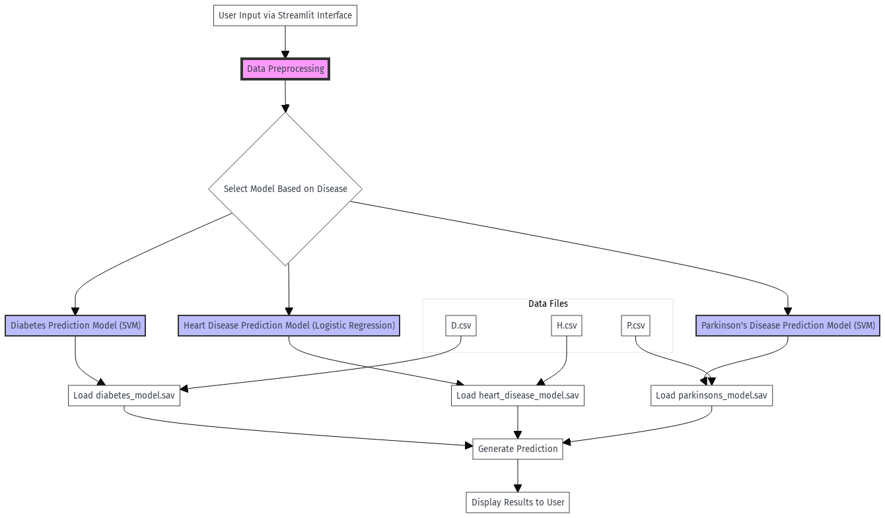

# Multiple Disease Prediction System

## Overview
The **Multiple Disease Prediction System** is a machine learning-powered web application that predicts the likelihood of three diseases—diabetes, heart disease, and Parkinson’s disease. Using pre-trained models, the application analyzes user inputs through a user-friendly interface built with Streamlit, providing predictions to aid early diagnosis.



## Project Motivation
This project aims to contribute to the healthcare field by providing a quick, accessible tool for disease prediction based on common health indicators. This can assist individuals and healthcare professionals with early detection, improving patient outcomes and enabling timely interventions.

## Features
- **Disease Prediction Models**: Predicts the likelihood of diabetes, heart disease, and Parkinson’s disease.
- **User Interface**: Interactive web-based application built with Streamlit, allowing users to input health data and receive instant predictions.
- **Data-Driven Insights**: Each disease model is trained on disease-specific datasets, ensuring the predictions are data-backed.
- **Scalable**: The system uses pre-trained machine learning models, which can be easily updated or extended for additional diseases.

## Architecture
The application is designed in a modular structure with the following main components:

- **Frontend**: A web interface created with Streamlit for user interaction.
- **Backend**: Machine learning models for each disease, saved as `.sav` files and loaded dynamically.
- **Data Processing**: Custom preprocessing pipelines for each disease to standardize user input data.

### Prediction Models:
- **Diabetes**: SVM model trained on the PIMA Diabetes Dataset.
- **Heart Disease**: Logistic Regression model trained on a heart disease dataset.
- **Parkinson’s Disease**: SVM model trained on vocal measurements for Parkinson’s detection.

## Project Structure
```bash
.
├── main.py                  # Main Streamlit app file for launching the application
├── diabetes_model.sav       # Trained model for diabetes prediction
├── heart_disease_model.sav  # Trained model for heart disease prediction
├── parkinsons_model.sav     # Trained model for Parkinson's disease prediction
├── D.csv                    # Diabetes dataset (PIMA Diabetes Dataset)
├── H.csv                    # Heart disease dataset
├── P.csv                    # Parkinson's disease dataset
├── sidebar.css              # Custom styling for Streamlit sidebar
├── style.css                # General styling for Streamlit app
├── requirements.txt         # Project dependencies
├── notebooks/
│   ├── Diabetes.ipynb       # Training notebook for Diabetes model
│   ├── Multiple_disease_prediction_system_heart.ipynb # Training notebook for Heart Disease model
│   └── Parkinsons.ipynb     # Training notebook for Parkinson's model
└── README.md                # Documentation file
```

## Technologies Used
- **Python**: Core programming language.
- **Streamlit**: Framework for creating the web-based UI.
- **Scikit-Learn**: Machine learning library used to train models.
- **Pickle**: Library for serializing and deserializing the trained models.
- **CSS**: Custom styling for enhancing the UI.

## Installation and Setup

### Prerequisites
- **Python** 3.7 or higher
- **Git** for cloning the repository

### Installation Steps

1. **Clone the Repository**:
   ```bash
   git clone https://github.com/theuntoldcreator/Multiple-Disease-Prediciton-Using-ML.git
   cd Multiple-Disease-Prediciton-Using-ML
   ```

2. **Create a Virtual Environment** (optional but recommended):
   ```bash
   python3 -m venv disease-prediction-env
   source disease-prediction-env/bin/activate
   ```

3. **Install the Dependencies**:
   ```bash
   pip install -r requirements.txt
   ```

4. **Run the Application**:
   ```bash
   streamlit run main.py
   ```

5. **Access the Web Application**: Open [http://localhost:8501](http://localhost:8501) in a browser.

## Usage Guide

1. **Launch the Application**: After running `streamlit run main.py`, access the app in your browser.
2. **Select a Disease**: Choose the disease you want to predict—Diabetes, Heart Disease, or Parkinson’s.
3. **Enter Required Information**:
   - **Diabetes**: Input fields for features like Pregnancies, Glucose, Blood Pressure, Skin Thickness, Insulin, BMI, Age, etc.
   - **Heart Disease**: Input fields for features like Age, Gender, Chest Pain Type, Blood Pressure, Cholesterol, Max Heart Rate, etc.
   - **Parkinson's Disease**: Input fields for various vocal features such as MDVP (Hz), MDVP (%), NHR, HNR, etc.
4. **Submit for Prediction**: Click on the predict button to view the prediction result, which indicates the likelihood of having the selected disease.

## Training the Models

### Model Details

- **Diabetes Model (SVM)**:
  - Trained on the PIMA Diabetes Dataset.
  - Utilizes features like glucose levels, blood pressure, insulin, and BMI.

- **Heart Disease Model (Logistic Regression)**:
  - Based on a dataset with heart-related metrics, such as age, cholesterol, and chest pain type.
  - Logistic Regression was chosen for its simplicity and effectiveness.

- **Parkinson’s Disease Model (SVM)**:
  - Focused on vocal characteristics, using metrics like jitter, shimmer, and NHR for disease prediction.

### Steps to Retrain Models
If you wish to retrain any of the models, use the Jupyter notebooks provided in the `notebooks/` directory:

1. **Launch Jupyter Notebook**:
   ```bash
   jupyter notebook
   ```

2. **Open the Relevant Notebook**: Open and run `Diabetes.ipynb`, `Multiple_disease_prediction_system_heart.ipynb`, or `Parkinsons.ipynb`.

3. **Export the Trained Model**: Save the new model using Pickle with:
   ```python
   import pickle
   with open('model_name.sav', 'wb') as file:
       pickle.dump(trained_model, file)
   ```

4. **Replace Model Files**: Replace the original `.sav` files with the newly trained models.

## Evaluation and Performance Metrics
The models were evaluated using a test dataset and the following metrics:

- **Accuracy**: Measures the overall correctness of predictions.
- **Confusion Matrix**: Provides insight into true vs. false predictions.
- **Classification Report**: Includes precision, recall, and F1-score.

### Model Performance Summary
- **Diabetes Prediction**: Accuracy ~77% on test data.
- **Heart Disease Prediction**: Accuracy ~82% with Logistic Regression.
- **Parkinson’s Prediction**: SVM achieved ~76% accuracy on the test set.

## Contributing
Contributions are welcome! If you have suggestions for improvements or want to add support for more diseases, feel free to fork the repository and submit a pull request.

1. **Fork the Repository**
2. **Create a New Branch**:
   ```bash
   git checkout -b feature-name
   ```

3. **Commit Changes**:
   ```bash
   git commit -m "Your detailed description of changes"
   ```

4. **Push to Your Branch**:
   ```bash
   git push origin feature-name
   ```

5. **Open a Pull Request**

## License
This project is licensed under the MIT License.

## Acknowledgments
- University of North Texas, Machine Learning Team
- Kaggle for providing datasets.

## Contact
For any inquiries or assistance, please contact the project maintainers via the GitHub repository.
